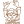
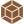
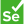
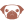
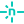
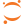

  

# 👋🏻 Hi

<!--
  Icons from:
    https://github.com/simple-icons/simple-icons
    https://simpleicons.org/?q=chart
    https://github.com/simpleicons/simpleicons.now.sh
    https://simpleicons.vercel.app/git/F05032
-->

<!-- Icons are generated from src/data/mystack.yml -->
Tech that I enjoy using:
<!-- START mystack -->
<section><h6>Languages</h6>            </section> <section><h6>Backend</h6>                                        </section> <section><h6>Frontend</h6>                            </section> <section><h6>Cross Platform</h6>      </section> <section><h6>JS/TS Tooling</h6>                </section> <section><h6>API</h6>        </section> <section><h6>DevOps</h6>              </section> <section><h6>DBs</h6>        </section> <section><h6>Cloud</h6>            </section> <section><h6>CLI</h6>      </section> <section><h6>AI / ML</h6>                              </section> <section><h6>Graphics</h6>              </section> <section><h6>Editors</h6>        </section> <section><h6>OS</h6>      </section> <section><h6>Hardware</h6>    </section> <section><h6>Productivity</h6>        </section> 
<!-- END mystack -->

## Interests

▲ ML ▲ SDLC ▲ CD/CI Automation ▲ Design Principles ▲ Design Patterns

## Fun stuff

▲ Electronics/MCUs/FPGAs ▲ Robotics ▲ Aero R/C ▲ Guitars + Amps ▲ Audio electronics ▲ Underwater electronics

  <a href="https://github.com/jv-k/jv-k" alt="generated dynamically">🤖</a>

<!-- Made with 🖤 -->
